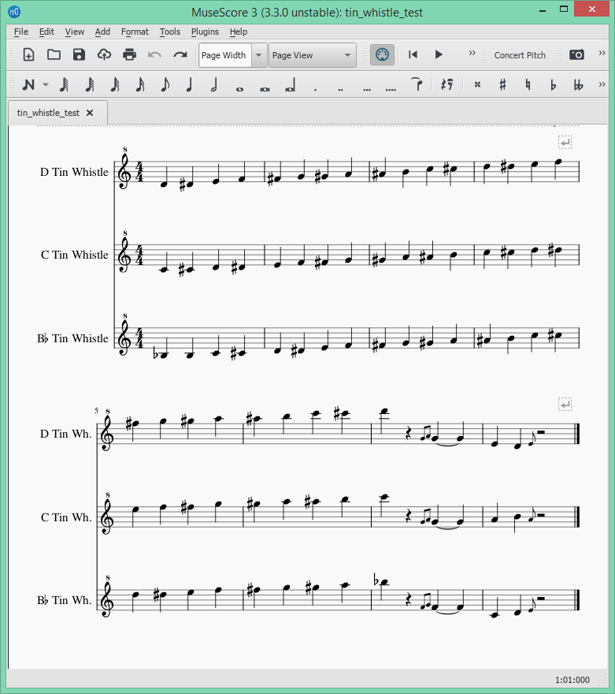
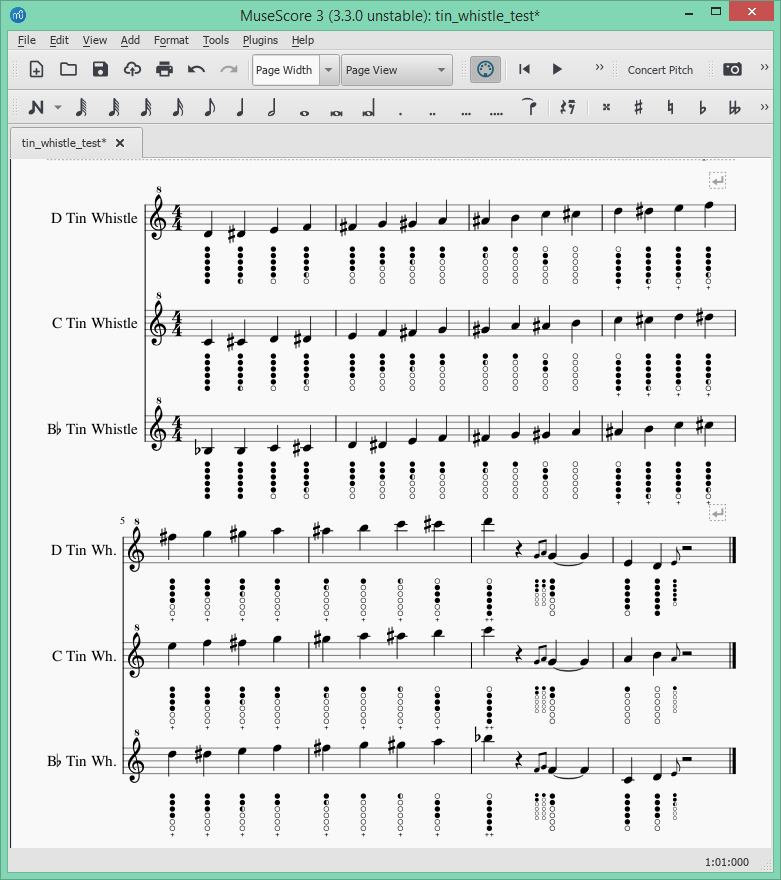
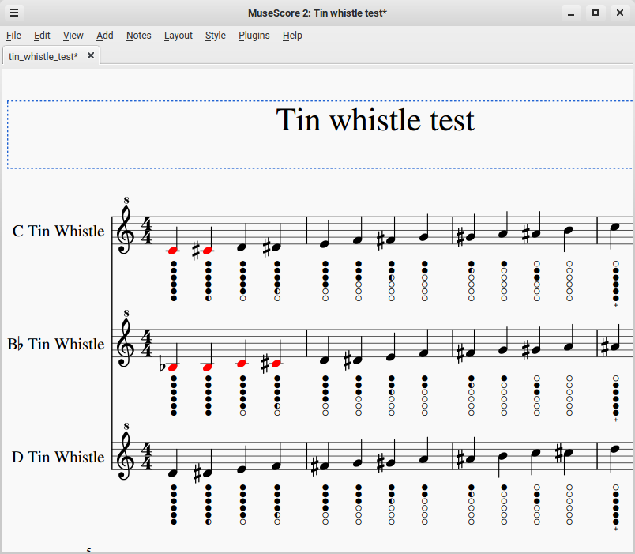

# tin-whistle-tablature
MuseScore plugin to add tablature / finger diagrams to a tin whistle staff in a score

### Introduction
This provides a plugin to automatically add fingering / tab diagrams to the
notes in scores for tin whistle. The plugin will adjust for tin whistles tuned
to D, C and Bb, according to the instrument defined for each staff. Note that
if the staff instrument is not a whistle then no tabs are applied, otherwise the
plugin will adjust the tab diagram position for the lowest note possible
(currently D, C or Bb).

Note that the plugin for MuseScore version 3 does not do this and assumes a tin
whistle tuned to D. This is due to some general issues with version 3 plugins,
so we expect to fix this in future.

### Installation
* If using MuseScore version 3 then download the
[plugin](https://github.com/jgadsden/tin-whistle-tablature/archive/master.zip) and unzip it.

* Alternatively if using the older version 2 then download this
[plugin](https://github.com/jgadsden/tin-whistle-tablature/archive/version2.zip).

* Install using the [instructions](https://musescore.org/en/handbook/3/plugins#installation)
in the MuseScore 3.x Handbook, which typically involves copying the QML file to
the local MuseScore Plugin directory. If you are using MuseScore version 2.x
then use this [handbook](https://musescore.org/en/handbook/plugins#installation) instead.

* Open MuseScore and navigate to
['Plugins' -> 'Plugin Manager'](https://musescore.org/en/handbook/3/plugins#enable-disable-plugins)
to enable the plugin. Tick the box against 'tin\_whistle\_tablature' and apply
with 'OK'.

* This plugin relies on a font being installed, which is not included in this
download but can be obtained from
[Blayne Chastain's site](https://www.blaynechastain.com/wp-content/uploads/TinWhistleTab.zip) .
To install the font it is usually just a case of double-clicking the downloaded
`.ttf` file and agreeing to the install process. If that does not work then on
linux systems try copying the TinWhistleTab.ttf font file to the
`/usr/share/fonts/truetype/` directory.

### Using the plugin
The tabs will be added to the highlighted bars if you have made a selection,
otherwise the whole score will have tabs added. Here is an example score before
applying the tabs:

When you wish to apply the tabs then navigate to 'Plugins' -> 'Tin Whistle' ->
'Add tablature'. Here is the score with the tabs now applied:

and the equivelent if using MuseScore 2 :

You can back out by navigating to 'Edit' -> 'Undo'.

### Other stuff
MuseScore Plugin API compatibility: 2.x

Issues: https://github.com/jgadsden/tin-whistle-tablature/issues

MuseScore issue tracker: https://musescore.org/en/project/issues/TinWhistleTablature

License: https://github.com/jgadsden/tin-whistle-tablature/blob/master/LICENSE

Download version 3 plugin from:
https://github.com/jgadsden/tin-whistle-tablature/archive/master.zip

Download the older version 2 plugin from:
https://github.com/jgadsden/tin-whistle-tablature/archive/version2.zip

Code repository: https://github.com/jgadsden/tin-whistle-tablature/

There are two branches for this plugin in the code repository: one for
MuseScore 2.x on a branch 'version2' and the other for Musecore 3.x on the
'master' branch.

### Here be Dragons
The version for MuseScore 2 will check that the staff is for a tin whistle and
adjust the tab diagram position for the lowest note possible. As of June'19 this
has not been possible for MuseScore 3 so the plugin just assumes that a whistle
tuned to D is used - this being the most common. 

Once the Instrument type is made available to version 3 plugins in version 3.2
then this can be fixed. The latest plug-in supports both the earlier default
selection of a D whistle if you are not running v3.2 of MuseScore.

Also, this plugin only supports grace notes that lead the main note. Tabs for
trailing grace notes will be rendered as leading notes which is probably not
what you want.

### Having problems?
Note that this plugin relies on a font being installed, see the Installation
instructions.

The plugin will skip any staffs that are not for a Tin Whistle, so for example
if the staff is for the Irish Flute then it will not apply the tabs. This makes
sense as other instrument's fingering will be different.

